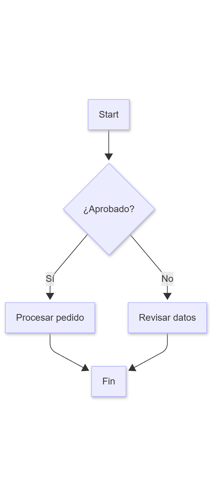
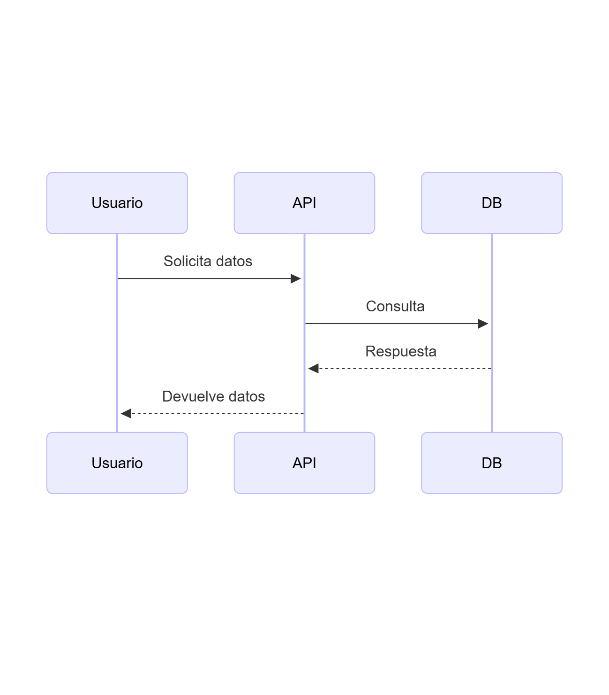
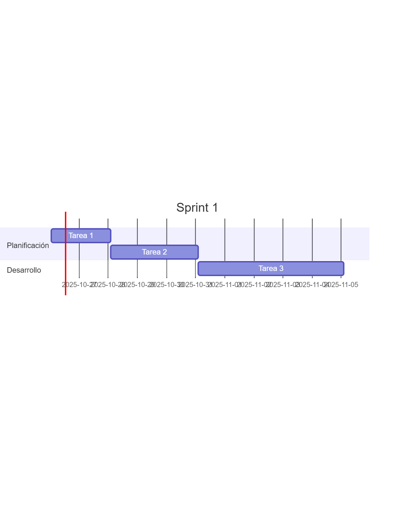
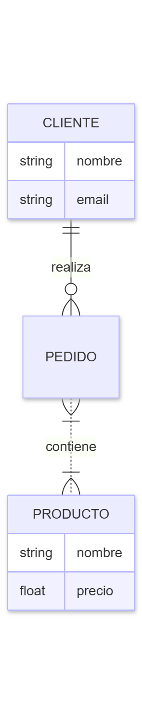
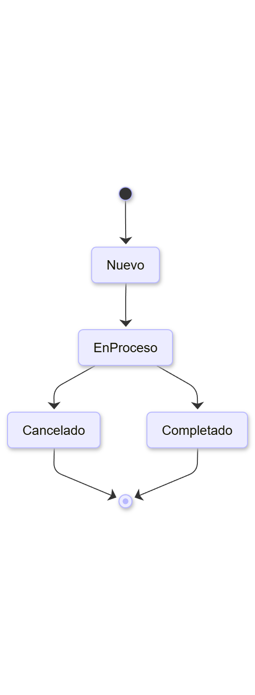
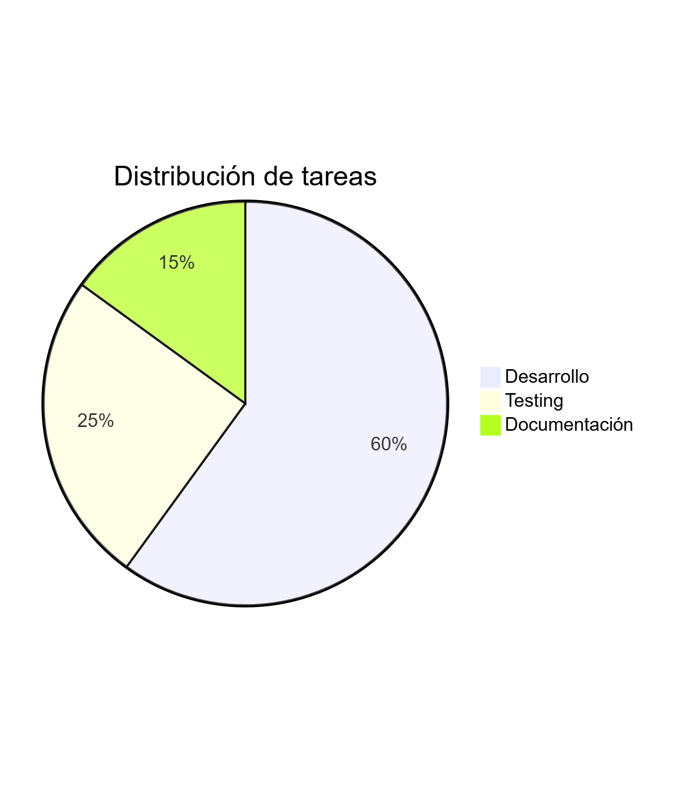
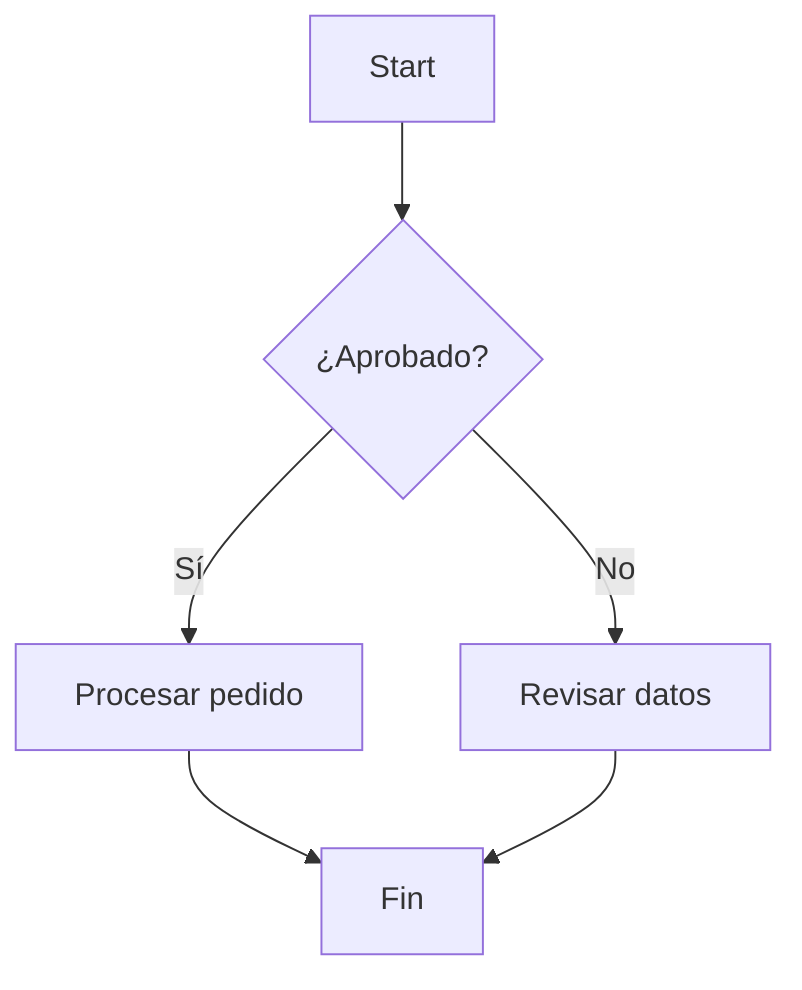

# 🖊️ Guía de Buenas Prácticas: Diagramas como Código con Mermaid (2025)

## Justificación: ¿Por qué diagramas como código?

¿Cuántas horas hemos perdido todos en PowerPoint, Visio o Lucidchart, arrastrando cajas, alineando flechas, cambiando colores? Esa era es historia. La técnica que les mostré brevemente antes con el diagrama de base de datos se puede aplicar a todo. Hablo de Mermaid.


Podemos pedirle a la IA:

- "Genera el código Mermaid para un flowchart que describa nuestro proceso de ventas."
- "Crea el código para un diagrama de secuencia que muestre cómo interactúan el usuario, la API y la base de datos."
- "Dame el código para un gráfico de Gantt para planificar el primer sprint de este proyecto."

Esto es revolucionario porque trata a los diagramas como lo que deberían ser: **código**. Un texto que puedes versionar en Git, editar en segundos y generar bajo demanda. Para demostrarlo, en mi repositorio ai-coding-best-practices también incluyo una sección con prompts específicos para la generación de diagramas complejos. Es una de las ganancias de productividad más inmediatas que pueden obtener.

---

## 📑 Tabla de contenidos

- [🎯 Objetivo](#-objetivo)
- [🛠️ Cómo usar Mermaid: herramientas y plugins](#️-cómo-usar-mermaid-herramientas-y-plugins)
  - [En Visual Studio Code](#en-visual-studio-code)
  - [En la web](#en-la-web)
  - [En otras plataformas](#en-otras-plataformas)
- [🆕 Características de Mermaid Moderno](#-características-de-mermaid-moderno)
  - [1️⃣ Flowcharts (diagramas de flujo)](#1️⃣-flowcharts-diagramas-de-flujo)
  - [2️⃣ Sequence diagrams (diagramas de secuencia)](#2️⃣-sequence-diagrams-diagramas-de-secuencia)
  - [3️⃣ Gantt charts (diagramas de Gantt)](#3️⃣-gantt-charts-diagramas-de-gantt)
  - [4️⃣ Class diagrams (diagramas de clases)](#4️⃣-class-diagrams-diagramas-de-clases)
  - [5️⃣ Entity Relationship diagrams (ERD)](#5️⃣-entity-relationship-diagrams-erd)
  - [6️⃣ State diagrams (diagramas de estados)](#6️⃣-state-diagrams-diagramas-de-estados)
  - [7️⃣ Pie, Quadrant, Timeline, User Journey](#7️⃣-pie-quadrant-timeline-user-journey)
- [8️⃣ Buenas prácticas para código Mermaid](#8️⃣-buenas-prácticas-para-código-mermaid)
- [🤖 Prompts para IAs generativas (Mermaid)](#-prompts-para-ias-generativas-mermaid)
  - [Prompt completo](#prompt-completo)
  - [Prompt corto](#prompt-corto)
- [✅ Checklist de Diagramas como Código](#-checklist-de-diagramas-como-código)
- [📚 Referencias y recursos](#-referencias-y-recursos)

---

## 🎯 Objetivo

- ✅ Maximizar la productividad y la mantenibilidad usando diagramas como código
- ✅ Versionar y automatizar la documentación visual
- ✅ Integrar la generación de diagramas en flujos CI/CD y documentación viva
- ✅ Prompts listos para IA y ejemplos BIEN/MAL

---

## 🛠️ Cómo usar Mermaid: herramientas y plugins

### En Visual Studio Code

Para trabajar con Mermaid en VS Code, se recomiendan los siguientes plugins **oficiales**:

1. **Mermaid Chart** (oficial)
   - Publisher: Mermaid Chart
   - ID: `mermaidchart.vscode-mermaid-chart`
   - Funcionalidades: Editor visual, preview, exportación a PNG/SVG
   - [Marketplace VS Code](https://marketplace.visualstudio.com/items?itemName=mermaidchart.vscode-mermaid-chart)

2. **Mermaid Preview** (oficial)
   - Publisher: Mermaid
   - ID: `mermaid-js.vscode-mermaid-preview`
   - Funcionalidades: Preview en tiempo real de archivos `.mmd` y bloques Mermaid en Markdown
   - [Marketplace VS Code](https://marketplace.visualstudio.com/items?itemName=mermaid-js.vscode-mermaid-preview)

3. **Markdown Preview Mermaid Support** (tercero)
   - Publisher: Matt Bierner
   - ID: `bierner.markdown-mermaid`
   - Funcionalidades: Renderiza bloques Mermaid en la preview de Markdown nativa de VS Code
   - [Marketplace VS Code](https://marketplace.visualstudio.com/items?itemName=bierner.markdown-mermaid)
   - ⚠️ Nota: Algunos usuarios reportan problemas de compatibilidad o rendimiento. Los plugins oficiales suelen funcionar mejor.

**Recomendación**: Instala **Mermaid Chart** y **Mermaid Preview** (ambos oficiales) para la mejor experiencia en VS Code.

### En la web

- **Mermaid Live Editor**: [https://mermaid.live/](https://mermaid.live/)
  - Editor oficial online con preview en tiempo real
  - Exportación a PNG, SVG, PDF
  - Compartir diagramas por URL
  - Ideal para prototipos rápidos y capturas de pantalla

### En otras plataformas

- **GitHub**: Soporte nativo de Mermaid en archivos Markdown (issues, PRs, README)
- **Notion**: Bloques de código Mermaid se renderizan automáticamente
- **Docusaurus**: Plugin oficial `@docusaurus/theme-mermaid`
- **MkDocs**: Plugin `mkdocs-mermaid2-plugin`
- **GitLab**: Soporte nativo en Markdown
- **Confluence**: Plugin de terceros disponible

---

## 🆕 Características de Mermaid Moderno

- Flowcharts, sequence, gantt, class, ER, state, pie, quadrant, timeline, user journey...
- Soporte para subgráficos, estilos personalizados, comentarios, enlaces y tooltips
- Integración con Markdown, GitHub, VS Code, Notion, Docusaurus, MkDocs...
- Exportación a SVG, PNG, PDF
- Plugins y extensiones para validación y preview

---

## 1️⃣ Flowcharts (diagramas de flujo)

Código Mermaid (copia y pega):

```text
flowchart TD
    Start --> Decision{¿Aprobado?}
    Decision -- Sí --> Tarea1[Procesar pedido]
    Decision -- No --> Tarea2[Revisar datos]
    Tarea1 --> Fin
    Tarea2 --> Fin
```

Diagrama renderizado:



---

## 2️⃣ Sequence diagrams (diagramas de secuencia)

Código Mermaid (copia y pega):

```text
sequenceDiagram
    participant Usuario
    participant API
    participant DB
    Usuario->>API: Solicita datos
    API->>DB: Consulta
    DB-->>API: Respuesta
    API-->>Usuario: Devuelve datos
```

Diagrama renderizado:



---

## 3️⃣ Gantt charts (diagramas de Gantt)

Código Mermaid (copia y pega):

```text
gantt
title Sprint 1
section Planificación
Tarea 1 :a1, 2025-10-26, 2d
Tarea 2 :a2, after a1, 3d
section Desarrollo
Tarea 3 :a3, after a2, 5d
```

Diagrama renderizado:



---

## 4️⃣ Class diagrams (diagramas de clases)

Código Mermaid (copia y pega):

```text
classDiagram
    class Usuario {
        +string nombre
        +string email
        +login()
    }
    class Admin {
        +string permisos
    }
    Usuario <|-- Admin
```

Diagrama renderizado:


---

## 5️⃣ Entity Relationship diagrams (ERD)

Código Mermaid (copia y pega):

```text
erDiagram
    CLIENTE ||--o{ PEDIDO : realiza
    PEDIDO }|..|{ PRODUCTO : contiene
    CLIENTE {
        string nombre
        string email
    }
    PRODUCTO {
        string nombre
        float precio
    }
```

Diagrama renderizado:



---

## 6️⃣ State diagrams (diagramas de estados)

Código Mermaid (copia y pega):

```text
stateDiagram-v2
    [*] --> Nuevo
    Nuevo --> EnProceso
    EnProceso --> Completado
    EnProceso --> Cancelado
    Cancelado --> [*]
    Completado --> [*]
```

Diagrama renderizado:



---

## 7️⃣ Pie, Quadrant, Timeline, User Journey

Código Mermaid (copia y pega):

```text
pie title Distribución de tareas
    "Desarrollo" : 60
    "Testing" : 25
    "Documentación" : 15
```

Diagrama renderizado:



---

## 8️⃣ Buenas prácticas para código Mermaid

- Versiona los diagramas como cualquier otro código fuente
- Usa comentarios (`%%`) para explicar partes complejas
- Prefiere nombres descriptivos para nodos y relaciones
- Divide diagramas grandes en subgráficos o archivos separados
- Usa estilos y clases para mantener coherencia visual
- Integra Mermaid en documentación Markdown y pipelines CI/CD
- Valida y previsualiza antes de hacer commit
- Añade ejemplos BIEN/MAL para cada tipo de diagrama

---

## 🤖 Prompts para IAs generativas (Mermaid)

### Prompt completo

````markdown
Eres un generador experto de diagramas como código usando Mermaid. Sigue estas reglas:

1. Elige el tipo de diagrama adecuado (flowchart, sequence, gantt, class, ER, state, pie...)
2. Usa sintaxis Mermaid moderna y válida
3. Añade comentarios (`%%`) para explicar partes complejas
4. Prefiere nombres descriptivos y consistentes
5. Divide diagramas grandes en subgráficos
6. Usa estilos y clases para coherencia visual
7. Valida el código antes de entregarlo
8. Entrega solo el bloque de código Mermaid, sin explicaciones extra

Ejemplo:


IMPORTANTE: El código debe ser válido y listo para pegar en VS Code, GitHub o Notion.
````

### Prompt corto

````markdown
Genera solo el código Mermaid para un diagrama [tipo] que muestre [descripción]. Usa sintaxis moderna y comentarios si es complejo.
````

---

## ✅ Checklist de Diagramas como Código

- [ ] ¿El diagrama está versionado en Git?
- [ ] ¿Usa sintaxis Mermaid moderna y válida?
- [ ] ¿Incluye comentarios (`%%`) donde es complejo?
- [ ] ¿Nombres descriptivos y consistentes?
- [ ] ¿Divide diagramas grandes en subgráficos?
- [ ] ¿Usa estilos y clases para coherencia visual?
- [ ] ¿Se integra en la documentación Markdown o pipeline?
- [ ] ¿Se ha validado y previsualizado antes del commit?

---

## 📚 Referencias y recursos

- [MermaidJS docs](https://mermaid-js.github.io/mermaid/#/)
- [VS Code Mermaid Preview](https://marketplace.visualstudio.com/items?itemName=vstirbu.vscode-mermaid-preview)
- [Mermaid Live Editor](https://mermaid.live/)
- [GitHub Docs: Mermaid diagrams](https://docs.github.com/en/get-started/writing-on-github/working-with-advanced-formatting/creating-diagrams)
- [Docusaurus + Mermaid](https://docusaurus.io/docs/markdown-features/diagrams)

---

**Autor**: [David Bueno Vallejo](https://davidbuenov.com/) | [LinkedIn](https://www.linkedin.com/in/davidbueno/) | [GitHub](https://github.com/davidbuenov)

**Licencia**: MIT
